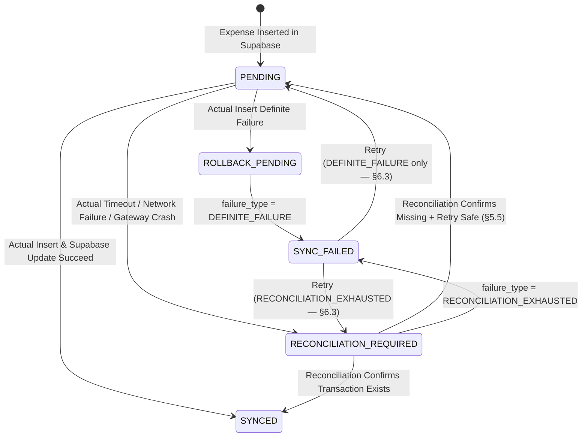
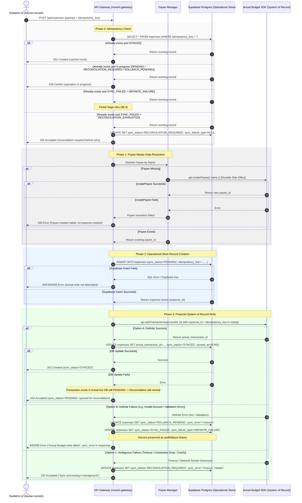

# Technical Architecture: Actual Budget Integration & Saga-Based Synchronization Flow

**Version:** 2.3  
**Status:** Approved Architectural Spec — Ready for Implementation  
**Financial System of Record:** Actual Budget (`https://budget.novianlabs.my.id`)  
**Tracker Operational Store:** Supabase (PostgreSQL)  
**Orchestrator:** `moneh-gateway` (Fastify)  
**API Documentation:** [https://actualbudget.org/docs/api/](https://actualbudget.org/docs/api/)

---

## 1. Executive Summary & Core Responsibilities

In this architecture, **Actual Budget** (`budget.novianlabs.my.id`) serves as the **Financial System of Record**, while **Supabase** (PostgreSQL) acts as the **Tracker Operational Store & Read Model**.

### System Responsibility Separation
- **Actual Budget (Financial System of Record)**: Authoritative for financial accounts, payees, budget categories, account balances, and financial transactions.
- **Supabase (Tracker Operational Store)**: Authoritative for Tracker UI state, fast analytical queries, user filters, integration metadata (`actual_transaction_id`, `sync_status`, `sync_failure_type`, `sync_error`, `idempotency_key`), synchronization logs, and failure audit history. Not every Tracker-specific field needs to exist in Actual Budget.

> [!IMPORTANT]
> **Cross-System Transaction Semantics**: Supabase and Actual Budget are independent, un-coordinated systems and cannot participate in a shared ACID transaction. Synchronization between them is orchestrated by `moneh-gateway` using **Saga-based Dual-Writes with Compensating Actions** and a **Background Reconciliation Engine**. Cross-system rollback is **best-effort** and cannot be guaranteed atomically.

### Core Retry Safety Rule

> **A definite Actual Budget failure may be directly retried. An unresolved/ambiguous Actual Budget failure must be reconciled before any new financial transaction is created.**

---

## 2. System Layer Architecture

```text
┌─────────────────────────────────────────────────────────┐
│                     tracker-moneh                       │
│                     (SvelteKit UI)                      │
└───────────┬─────────────────────────────────────────────┘
            │ REST API Requests (JSON / Cookies)
            ▼
┌─────────────────────────────────────────────────────────┐
│                     moneh-gateway                       │
│              (Fastify API Gateway Server)               │
│  - Actual Budget SDK Manager (@actual-app/api)          │
│  - Saga Dual-Write Orchestrator                         │
│  - Idempotency & Reconciliation Engine                  │
└───────────┬─────────────────────────────┬───────────────┘
            │ SQL Queries                 │ Headless Node SDK / Sync
            ▼                             ▼
┌───────────────────────┐   ┌─────────────────────────────┐
│   Supabase Postgres   │   │        Actual Budget        │
│  (Operational Store)  │   │ (System of Record: Ledger)  │
└───────────────────────┘   └─────────────────────────────┘
```

---

## 3. Data Mapping & Payee Resolution Semantics

### 3.1 Data Mapping Matrix

| Tracker / Gateway Entity | Actual Budget Entity | Business Logic & Rules |
| :--- | :--- | :--- |
| `payment_method` | `Account` (`account_id`) | Each payment method (e.g. Cash, Credit Card) maps to an Actual Budget Account. |
| `description` / Merchant | `Payee` (`payee_id`) | Resolved via Payee Master-Data workflow (§3.2). |
| `category` | `Category` (`category_id`) | Mapped by category ID or name matching between systems. |
| `amount` | `Amount` (Integer units) | Formatted into integer currency units as required by Actual Budget precision. |
| `expense_date` | `date` (`YYYY-MM-DD`) | ISO Date string. |

### 3.2 Payee Resolution Semantics
Payee creation is an **idempotent, durable master-data side effect**, not part of the expense transaction rollback boundary.

```text
Resolve Payee by Description / Merchant Name
              │
              ├── Existing Match Found ──> Reuse existing payee_id
              │
              └── No Match Found ──────> Call api.createPayee({ name })
                                         └─> Durable side-effect (Payee remains even if expense fails)
```

If Payee creation succeeds but the subsequent expense transaction fails or times out, the newly created Payee **remains in Actual Budget** as valid master data for future reuse. Gateway does not attempt to delete Payees during expense rollback.

---

## 4. Correlation Identifiers

The integration maintains two distinct identifiers for every expense operation:

| Identifier | Purpose | Lifecycle |
| :--- | :--- | :--- |
| `expense_id` (Supabase PK) | **Business identity** of the Tracker expense record. Immutable once created. Used as the primary correlation key when linking Supabase records to Actual Budget transactions. | Assigned on Supabase INSERT. Persists for the lifetime of the record (including `SYNC_FAILED` records). |
| `idempotency_key` | **Client/request operation identity** used to prevent duplicate `POST /api/expenses` processing at the gateway level. | Generated by the client or gateway per unique user submission. Subject to a `UNIQUE` constraint in Supabase. |

When creating the Actual Budget transaction, both identifiers are embedded in the transaction metadata for correlation:

```text
[moneh_expense_id: <expense_id>]
[moneh_idempotency_key: <idempotency_key>]
```

> [!NOTE]
> The exact Actual Budget field used for embedding correlation identifiers (e.g. `notes` field on the transaction object) is **implementation-dependent** and must be verified against the actual capabilities of `@actual-app/api`. See §7.4 for the implementation dependency.

---

## 5. Operational Data Model & Sync State Machine

### 5.1 Integration Schema Extensions (Supabase `expenses` Table)

```sql
ALTER TABLE expenses ADD COLUMN IF NOT EXISTS actual_transaction_id TEXT;
ALTER TABLE expenses ADD COLUMN IF NOT EXISTS sync_status TEXT NOT NULL DEFAULT 'PENDING';
ALTER TABLE expenses ADD COLUMN IF NOT EXISTS sync_failure_type TEXT;
ALTER TABLE expenses ADD COLUMN IF NOT EXISTS sync_error TEXT;
ALTER TABLE expenses ADD COLUMN IF NOT EXISTS synced_at TIMESTAMPTZ;
ALTER TABLE expenses ADD COLUMN IF NOT EXISTS idempotency_key TEXT UNIQUE;
```

### 5.2 Sync Status Definitions

| Status | Meaning |
| :--- | :--- |
| `PENDING` | Expense record exists in Supabase. Actual Budget transaction write is in progress or has not yet been attempted. `sync_failure_type` is `NULL`. |
| `SYNCED` | Transaction verified present in both Supabase and Actual Budget. `actual_transaction_id` and `synced_at` are populated. `sync_failure_type` is `NULL`. |
| `ROLLBACK_PENDING` | Actual Budget insertion returned a definite failure. Compensating state update is in progress. Transient state — should resolve to `SYNC_FAILED` within seconds. If stale, reconciliation advances it. `sync_failure_type` is `NULL` (set on transition to `SYNC_FAILED`). |
| `SYNC_FAILED` | Terminal failure state. The expense record is preserved with `sync_error` and `sync_failure_type` describing the failure classification. Available for retry or user inspection. **Retry behavior depends on `sync_failure_type`** (see §5.3). |
| `RECONCILIATION_REQUIRED` | Ambiguous outcome (timeout, connection drop, gateway crash). The transaction may or may not exist in Actual Budget. Requires background reconciliation. `sync_failure_type` is `NULL`. |

### 5.3 Failure Classification (`sync_failure_type`)

The `sync_failure_type` field is populated **only** when `sync_status = 'SYNC_FAILED'`. It is `NULL` for all other statuses.

| Value | Meaning | Retry Safety |
| :--- | :--- | :--- |
| `DEFINITE_FAILURE` | Actual Budget **definitively rejected** the transaction (e.g. 4xx, validation error, invalid account). The gateway knows with certainty that no transaction was created in Actual Budget. | **Safe to directly retry** the Actual Budget write via partial Saga re-execution. |
| `RECONCILIATION_EXHAUSTED` | The gateway **could not conclusively determine** whether the Actual Budget transaction exists after exhausting reconciliation attempts. The transaction may still exist in Actual Budget. | **NOT safe to directly retry.** Must reconcile again before any new Actual Budget write to prevent potential duplicate financial transactions. |

> [!CAUTION]
> The system must **never** blindly create a new Actual Budget transaction from a `RECONCILIATION_EXHAUSTED` failure. Doing so risks creating a duplicate financial entry. The record must be routed through reconciliation before any Actual Budget write is permitted.

### 5.4 Sync Lifecycle State Machine



### 5.5 Guarded Transition: `RECONCILIATION_REQUIRED → PENDING`

This transition is **only** permitted when reconciliation has confirmed **all three** of the following conditions:

1. No matching transaction exists in Actual Budget for this `expense_id` / `idempotency_key`.
2. The original operation is safe to retry (no partial or ambiguous state remains).
3. No matching transaction was found using the correlation identifiers embedded in Actual Budget transaction metadata.

```text
RECONCILIATION_REQUIRED
        │
        ├── Transaction found in Actual Budget ──────────> SYNCED
        │
        ├── Transaction confirmed missing
        │   + All correlation lookups negative
        │   + Retry assessed as safe
        │   └──────────────────────────────────────────> PENDING (retry)
        │
        ├── State cannot be safely determined ───────────> remain RECONCILIATION_REQUIRED
        │
        └── Max retries exhausted / unresolvable ───────> SYNC_FAILED (RECONCILIATION_EXHAUSTED)
```

If the reconciliation engine cannot safely determine the state, the record **remains** in `RECONCILIATION_REQUIRED` until the next reconciliation cycle. It transitions to `SYNC_FAILED` with `sync_failure_type = 'RECONCILIATION_EXHAUSTED'` only after the documented retry policy is exhausted.

---

## 6. Saga-Based Dual-Write & Sequence Flows

### 6.1 Idempotent Request Handling

Before executing the Saga, the gateway checks for duplicate requests:

```text
POST /api/expenses received with idempotency_key
        │
        ├── idempotency_key found in Supabase
        │       │
        │       ├── sync_status = SYNCED
        │       │       └──> Return cached 201 response
        │       │
        │       ├── sync_status = PENDING
        │       │       └──> Return 409 (operation in progress)
        │       │
        │       ├── sync_status = RECONCILIATION_REQUIRED
        │       │       └──> Return 409 (reconciliation in progress)
        │       │
        │       ├── sync_status = ROLLBACK_PENDING
        │       │       └──> Return 409 (compensation in progress)
        │       │
        │       └── sync_status = SYNC_FAILED
        │               │
        │               ├── sync_failure_type = DEFINITE_FAILURE
        │               │       └──> Partial Saga retry on existing record (§6.3)
        │               │
        │               └── sync_failure_type = RECONCILIATION_EXHAUSTED
        │                       └──> Transition to RECONCILIATION_REQUIRED (§6.3)
        │                            Return 202 Accepted (reconciliation required before retry)
        │
        └── idempotency_key not found ─────────────> Proceed with new Saga execution (§6.2)
```

> [!IMPORTANT]
> The gateway **never** creates a new Actual Budget transaction when the existing Supabase record for the same `idempotency_key` is in `PENDING`, `RECONCILIATION_REQUIRED`, or `ROLLBACK_PENDING`. For `SYNC_FAILED` records, retry behavior depends on `sync_failure_type`. A `RECONCILIATION_EXHAUSTED` record must be reconciled before any Actual Budget write is permitted.

### 6.2 Create Expense Saga Sequence (New Record)

This flow applies when `idempotency_key` is **not found** in Supabase (first submission).



### 6.3 Retry Execution on Existing Record

When the gateway encounters an existing record with `sync_status = 'SYNC_FAILED'` — either via idempotent re-submission (same `idempotency_key`) or manual/admin retry — the behavior depends on `sync_failure_type`:

#### A. `DEFINITE_FAILURE` → Partial Saga Re-execution

The gateway knows that no Actual Budget transaction was created. It is safe to directly retry the write.

```text
Existing record: sync_status = SYNC_FAILED, sync_failure_type = DEFINITE_FAILURE
        │
        1. UPDATE expenses SET sync_status = 'PENDING',
                                sync_failure_type = NULL,
                                sync_error = NULL,
                                synced_at = NULL
        │
        2. Phase 1: Re-resolve Payee (idempotent — finds existing or re-creates)
        │   └── If Payee resolution fails → UPDATE sync_status = 'SYNC_FAILED',
        │                                          sync_failure_type = 'DEFINITE_FAILURE',
        │                                          sync_error = '<reason>'
        │
        3. Phase 2: SKIP (record already exists in Supabase)
        │
        4. Phase 3: Actual Budget write (same as §6.2 Phase 3)
```

#### B. `RECONCILIATION_EXHAUSTED` → Reconciliation Required Before Retry

The gateway does **not** know whether an Actual Budget transaction exists. Creating a new one risks a duplicate financial entry.

```text
Existing record: sync_status = SYNC_FAILED, sync_failure_type = RECONCILIATION_EXHAUSTED
        │
        1. UPDATE expenses SET sync_status = 'RECONCILIATION_REQUIRED',
                                sync_failure_type = NULL,
                                sync_error = NULL
        │
        2. Return 202 Accepted ("Reconciliation required before retry")
        │
        3. Background reconciliation will determine Actual Budget state:
           ├── Transaction found → SYNCED
           ├── Transaction confirmed missing + retry safe → PENDING → Actual write
           ├── State cannot be determined → remain RECONCILIATION_REQUIRED
           └── Exhausted again → SYNC_FAILED (RECONCILIATION_EXHAUSTED)
```

> [!NOTE]
> Phase 2 (Supabase INSERT) is never needed for retry because the record already occupies the `idempotency_key` under a `UNIQUE` constraint. The existing record is reused.

### 6.4 Record Preservation Policy

When Actual Budget returns a **definite failure**, the gateway executes the following compensation:

```text
1. UPDATE expenses SET sync_status = 'ROLLBACK_PENDING', sync_error = '<failure reason>'
2. UPDATE expenses SET sync_status = 'SYNC_FAILED', sync_failure_type = 'DEFINITE_FAILURE'
```

The expense record is **preserved** in Supabase with `sync_status = 'SYNC_FAILED'`, a descriptive `sync_error`, and `sync_failure_type` classifying the failure. This ensures:
- Failure history is observable in the Tracker UI and sync logs.
- The user can inspect the failure reason and the retry safety classification.
- No audit trail is lost.

> [!WARNING]
> **Hard-deletion of expense records is not the default compensation strategy.** Hard-delete should only be used in exceptional cases where the record must be removed for data integrity reasons (e.g., a constraint violation that makes the record itself invalid). Any such case must be explicitly documented and logged. The default is always to preserve the record with `SYNC_FAILED` status.

---

## 7. Ambiguous Response Handling & Reconciliation Mechanism

### 7.1 The Ambiguous Failure Problem
When `moneh-gateway` sends a transaction request to Actual Budget, a timeout or network socket drop can occur **after** Actual Budget has successfully recorded the transaction but **before** the HTTP response reaches the gateway.

In this scenario:
- Gateway **cannot** assume the transaction failed.
- Gateway **must not** blindly retry insertion (to avoid duplicate financial entries).
- Gateway **cannot** guarantee immediate rollback.

### 7.2 Idempotency Strategy
To prevent duplicate financial entries:
1. Gateway generates or receives a deterministic `idempotency_key` for every expense request.
2. When posting to Actual Budget, Gateway embeds both `expense_id` and `idempotency_key` in the transaction metadata (see §4).
3. Duplicate `POST /api/expenses` handling follows the idempotent request flow defined in §6.1, including `sync_failure_type`-aware retry routing.

### 7.3 Background Reconciliation Engine
`moneh-gateway` runs a periodic background reconciliation process:

```text
Reconciliation Algorithm:

1. Fetch expenses FROM Supabase
   WHERE sync_status IN ('RECONCILIATION_REQUIRED', 'PENDING', 'ROLLBACK_PENDING')
   AND (updated_at < NOW() - reconciliation_grace_period)

2. For each expense:

   a. IF sync_status = 'ROLLBACK_PENDING':
      → The gateway crashed between setting ROLLBACK_PENDING and SYNC_FAILED.
      → The Actual Budget failure was already confirmed as definite.
      → UPDATE sync_status = 'SYNC_FAILED', sync_failure_type = 'DEFINITE_FAILURE'
         (sync_error already contains the failure reason from the original attempt)
      → Continue to next record.

   b. Retrieve transactions from Actual Budget for the mapped account.
      (See §7.4 for implementation dependency.)

   c. Search retrieved transactions for a match using correlation
      identifiers (expense_id / idempotency_key in transaction metadata).

   d. IF MATCH FOUND:
      → UPDATE Supabase:
        actual_transaction_id = match.id,
        sync_status = 'SYNCED',
        sync_failure_type = NULL,
        synced_at = NOW(),
        sync_error = NULL

   e. IF NO MATCH FOUND:
      → Confirm: no matching transaction exists in Actual Budget.
      → Confirm: retry is safe (no partial state).
      → IF both confirmed:
          - IF state is RECONCILIATION_REQUIRED:
              UPDATE sync_status = 'PENDING', sync_failure_type = NULL
              (allows retry on next cycle)
          - IF state is PENDING (stale):
              Attempt Actual Budget insertion directly.
              If insertion succeeds → set SYNCED, sync_failure_type = NULL.
              If insertion definitely fails → set SYNC_FAILED, sync_failure_type = 'DEFINITE_FAILURE'.
              If insertion times out → set RECONCILIATION_REQUIRED.
      → IF cannot safely determine:
          Remain in current state (retry on next cycle)

   f. IF MAX RETRIES EXHAUSTED:
      → UPDATE sync_status = 'SYNC_FAILED',
        sync_failure_type = 'RECONCILIATION_EXHAUSTED',
        sync_error = 'Reconciliation exhausted after N attempts'
      → Surface for manual user intervention.
```

Reconciliation serves as the safety net for distributed failures occurring outside the synchronous HTTP request lifecycle (gateway crashes, network drops, Actual Budget restarts).

### 7.4 Implementation Dependency: Actual Budget Transaction Lookup

> [!WARNING]
> **Architecture Assumption (Not Yet Verified):** The reconciliation mechanism assumes that the gateway can locate an existing Actual Budget transaction by searching for correlation identifiers (`expense_id`, `idempotency_key`) stored in the transaction's notes or metadata field.
>
> This capability has **not been verified** against the actual `@actual-app/api` SDK. The `@actual-app/api` documentation must be checked during implementation to confirm:
>
> 1. Whether `api.getTransactions(accountId)` or equivalent can retrieve transactions for a given account.
> 2. Whether retrieved transaction objects include a `notes` field (or similar metadata) that can be read and searched.
> 3. Whether `api.addTransactions()` accepts and persists a `notes` field on the transaction object.
>
> **If direct lookup by notes/metadata is not supported by the SDK**, reconciliation must:
> - Retrieve all recent transactions for the relevant account within a time window.
> - Perform correlation matching in the gateway application layer (match by amount, date, and any available metadata).
>
> Do not assume this API capability exists until verified from the SDK source or documentation.

---

## 8. Error Handling & Recovery Matrix

| Failure Scenario | `sync_status` | `sync_failure_type` | Actual Budget State | Recovery Action |
| :--- | :--- | :--- | :--- | :--- |
| **Payee creation fails** | No record | — | No payee / No transaction | Return error to client. No expense created. |
| **Supabase insert fails** | No record | — | Payee may exist (durable) | Return error to client. Actual write not attempted. |
| **Actual transaction definite failure** | `ROLLBACK_PENDING` → `SYNC_FAILED` | `DEFINITE_FAILURE` | No transaction | Record failure with `sync_error`. Return error. Safe to retry. |
| **Actual transaction times out** | `RECONCILIATION_REQUIRED` | `NULL` | Unknown | Return 202 Accepted. Reconciliation determines state. |
| **Actual succeeds, Supabase update fails** | `PENDING` (stale) | `NULL` | Transaction exists | Reconciliation matches correlation ID → `SYNCED`. |
| **Gateway crashes after Actual succeeds** | `PENDING` / `RECONCILIATION_REQUIRED` | `NULL` | Transaction exists | Reconciliation recovers → `SYNCED`. |
| **Gateway crashes between `ROLLBACK_PENDING` and `SYNC_FAILED`** | `ROLLBACK_PENDING` (stale) | `NULL` | No transaction | Reconciliation → `SYNC_FAILED` (`DEFINITE_FAILURE`). |
| **Reconciliation confirms transaction exists** | → `SYNCED` | `NULL` | Transaction exists | Link `actual_transaction_id`, set `synced_at`. |
| **Reconciliation confirms missing + retry safe** | → `PENDING` | `NULL` | No transaction | Safe retry on next cycle. |
| **Reconciliation cannot determine state** | Remains `RECONCILIATION_REQUIRED` | `NULL` | Unknown | Retry on next reconciliation cycle. |
| **Reconciliation exhausted (max retries)** | → `SYNC_FAILED` | `RECONCILIATION_EXHAUSTED` | Unknown | Manual intervention. **NOT safe to directly retry.** |
| **Retry of `DEFINITE_FAILURE`** | → `PENDING` | `NULL` | No transaction | Partial Saga (Phase 1 + 3, skip Phase 2). |
| **Retry of `RECONCILIATION_EXHAUSTED`** | → `RECONCILIATION_REQUIRED` | `NULL` | Unknown | Reconciliation first, then retry if safe. |

---

## 9. Actual Budget SDK Lifecycle Management

`moneh-gateway` manages the connection to Actual Budget using `@actual-app/api` within the Node.js runtime. The SDK holds a **single active budget per process** — there is no built-in multi-tenancy — so as of §11 the gateway initializes the SDK connection once (server URL + password, both still gateway-wide), then downloads/switches the *active budget* per-request based on the authenticated user's `actual_sync_id`:

```typescript
import api from '@actual-app/api';
import { config } from '../config/env.js';

// One-time: server connection only. No ACTUAL_SYNC_ID here anymore.
export async function initActualBudget() {
  await api.init({
    dataDir: './budget-data',
    serverURL: config.actualServerUrl,
    password: config.actualPassword
  });
}

// Per-request: switch the active budget to the calling user's own sync id.
export async function ensureConnected(actualSyncId: string) {
  await api.downloadBudget(actualSyncId);
}
```

> [!WARNING]
> Because the active budget is a process-global pointer, two requests from **different users** arriving concurrently can race on which budget is active when each write actually executes. `moneh-gateway` reduces this by only re-downloading when the requested `actualSyncId` differs from the currently active one, but true request-level isolation would require either a serialized queue per sync id or one SDK process per budget. Acceptable for current traffic volume; revisit if concurrent multi-user writes become common.

---

## 10. Next Implementation Milestones

1. **Verify Actual Budget SDK Capabilities**: Confirm `@actual-app/api` support for transaction `notes` field, `getTransactions()`, and metadata persistence (resolves §7.4 dependency).
2. **Schema Migration**: Add `actual_transaction_id`, `sync_status`, `sync_failure_type`, `sync_error`, `synced_at`, and `idempotency_key` columns to Supabase `expenses` table.
3. **Gateway Environment Update**: Add Actual Budget environment variables (`ACTUAL_SERVER_URL`, `ACTUAL_PASSWORD`) to `moneh-gateway/.env`. `ACTUAL_SYNC_ID` is **not** an env var — see §11.
4. **Saga & Reconciliation Service Implementation**: Build `actual.service.ts` and `reconciliation.service.ts` in `moneh-gateway`.

---

## 11. Multi-User, Multi-Budget Support

> Tracks issue #2. Supersedes the single gateway-wide `ACTUAL_SYNC_ID` model described in §9's original design.

### 11.1 Motivation

The original design pinned `ACTUAL_SYNC_ID` as a gateway environment variable, meaning one Gateway instance could only ever write to one Actual Budget. That prevents multiple Tracker users from each having their own budget behind a shared Gateway/Tracker deployment.

### 11.2 Schema

```sql
CREATE TABLE public.users_configurations (
    id uuid primary key default gen_random_uuid(),
    user_id uuid not null references auth.users(id) on delete cascade unique,
    actual_sync_id text unique,  -- nullable: "not configured yet" is a valid state
    created_at timestamptz not null default now(),
    updated_at timestamptz not null default now()
);
```

RLS: each user may `SELECT` / `INSERT` / `UPDATE` only their own row (`auth.uid() = user_id`).

### 11.3 Resolution Rule

For every Actual Budget operation, the Gateway resolves availability per authenticated user (`userConfigService.resolveActualAvailability`) instead of reading a single env var:

| `USE_ACTUAL` (env) | `users_configurations.actual_sync_id` | Result |
| :--- | :--- | :--- |
| `false` | — | Actual sync disabled. Same as before — no warning (feature intentionally off). |
| `true` | blank / not set | Treated **as if `USE_ACTUAL=false`** for that user: expenses still save to Supabase as `PENDING`, no Actual write attempted. Response includes `warning: "Your Actual sync ID is empty. Please set it up on the configuration page."` |
| `true` | set | Normal Saga dual-write flow (§6), using that user's `actual_sync_id` to resolve the active budget. |

This rule applies uniformly to: expense create/update/delete/retry, payee listing, master-data sync, and sync-status reporting.

### 11.4 Background Reconciliation

The reconciliation engine (§7.3) scans `expenses` across **all** users. It now resolves `actual_sync_id` per `expense.user_id` (cached per cycle) before attempting any Actual Budget lookup/write for that record. Records belonging to a user with no `actual_sync_id` configured are skipped for that cycle (logged, not treated as a failure) rather than erroring.

### 11.5 Configuration API

Users manage their own `actual_sync_id` via:
- `GET /api/config` — current `useActual` flag + this user's `actualSyncId`.
- `PUT /api/config/actual-sync-id` — set/clear this user's `actualSyncId`.

The Tracker frontend's "configuration page" (referenced in the warning message) is expected to call these endpoints.
