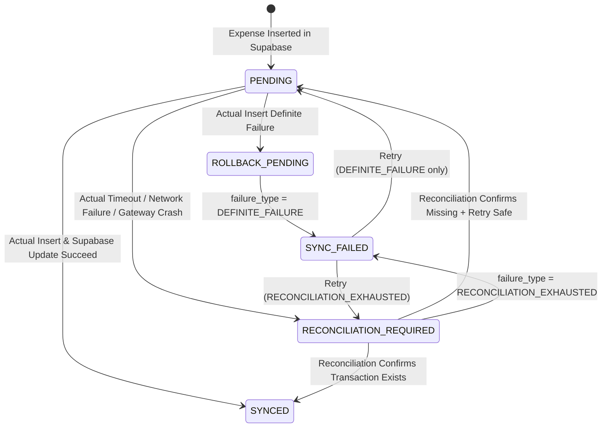

# Technical Specification: `moneh-gateway`

**Version:** 1.0
**Status:** Current
**Base Docs:** [ARCHITECTURE.md](ARCHITECTURE.md), [DATABASE.md](DATABASE.md), [DECISIONS.md](DECISIONS.md)
**Full Saga Sequence Diagrams:** [ACTUAL_BUDGET_INTEGRATION.md](ACTUAL_BUDGET_INTEGRATION.md) §6

---

## 1. API Surface

Full route reference (auth, expenses, categories, payment methods, sync, config, health) lives in the top-level [README.md](../README.md#-api-route-reference) — kept there so it stays next to run/deploy instructions.

## 2. Synchronization State Machine

State/failure-type definitions: [ACTUAL_BUDGET_INTEGRATION.md §5](ACTUAL_BUDGET_INTEGRATION.md#5-operational-data-model--sync-state-machine).

## 3. Idempotency

`POST /api/expenses` accepts a client-supplied `idempotency_key` (falls back to a gateway-generated one). Duplicate submissions with an existing key never create a second Actual Budget transaction — behavior branches on the existing record's `sync_status`/`sync_failure_type` (see [ACTUAL_BUDGET_INTEGRATION.md §6.1](ACTUAL_BUDGET_INTEGRATION.md#61-idempotent-request-handling)).

## 4. Background Reconciliation

Runs on an interval (`RECONCILIATION_INTERVAL_MS`), scanning `expenses` across **all** users for records past `RECONCILIATION_GRACE_PERIOD_MS` in `PENDING` / `ROLLBACK_PENDING` / `RECONCILIATION_REQUIRED`. Resolves `actual_sync_id` per `expense.user_id` (cached per cycle); users with no `actual_sync_id` configured are skipped for that cycle, not treated as a failure. Full algorithm: [ACTUAL_BUDGET_INTEGRATION.md §7.3](ACTUAL_BUDGET_INTEGRATION.md#73-background-reconciliation-engine).

## 5. Error Catalog

| Code | Meaning |
| :--- | :--- |
| `EXP002` | Expense amount must be > 0 |
| `EXP003` | Cannot edit an expense already synced to Google Sheets (`is_upload = 'Y'`) |
| `EXP004` | Expense not found |
| `EXP005` | Only `SYNC_FAILED` expenses can be explicitly retried |
| `DB001` | Supabase insert failed |
| `ACT001` | Actual Budget env config or `actual_sync_id` missing |
| `ACT002` | No matching active Actual Budget account for the payment method |
| `ACT003` | Actual Budget did not return a transaction ID |
| `ACT004` | Payee master-data resolution failed |
| `ACT005` | Actual Budget rejected the transaction (definite failure) |
| `ACT006` | Retry write rejected by Actual Budget |
| `ACT007` | Actual Budget sync disabled (`USE_ACTUAL=false` or no `actual_sync_id`) |
| `ACT008` | Bills category not found in Actual Budget (auto-adjust — see [features/auto-adjust-bills-credit-card.md](features/auto-adjust-bills-credit-card.md)) |
| `CFG001`/`CFG002`/`CFG003` | Config load/update failures (`actual-sync-id`, `bills-category`) |
| `PM001`/`PM002` | Payment method validation (empty name / non-boolean `is_credit_card`) |
| `REC001` | Reconciliation query failed |

Full recovery matrix (state × failure × Actual state × action): [ACTUAL_BUDGET_INTEGRATION.md §8](ACTUAL_BUDGET_INTEGRATION.md#8-error-handling--recovery-matrix).

## 6. Environment Configuration & Feature Flags

| Variable | Purpose |
| :--- | :--- |
| `USE_ACTUAL` | Master feature flag for the Actual Budget write path — see [DECISIONS.md ADR-003](DECISIONS.md#adr-003-feature-flagging-for-actual-budget-use_actual) |
| `ACTUAL_SERVER_URL` / `ACTUAL_PASSWORD` | Gateway-wide Actual Budget server connection (SDK `init`) |
| `ACTUAL_DATA_DIR` | Local SQLite budget cache directory |
| `RECONCILIATION_INTERVAL_MS` / `RECONCILIATION_GRACE_PERIOD_MS` / `MAX_RECONCILIATION_RETRIES` | Background reconciliation tuning |

`ACTUAL_SYNC_ID` is intentionally **not** an env var — it's per-user, see [DECISIONS.md ADR-004](DECISIONS.md#adr-004-multi-user-multi-budget-via-users_configurations). Full list with example `.env`: [README.md](../README.md#%EF%B8%8F-environment-variables).

## 7. Database RPCs & Views

See [DATABASE.md §3–§4](DATABASE.md#3-views).

## 8. Non-Functional Notes

- **Single Actual SDK process**: one active budget per gateway process; per-request budget switching and a per-`actualSyncId` mutex (for budget read-then-write ops) mitigate but don't eliminate cross-user races. See [ARCHITECTURE.md §4](ARCHITECTURE.md#4-actual-budget-sdk-lifecycle).
- **Best-effort side effects**: master-data sync and Bills budget auto-adjustment never fail the primary operation (expense create) — failures are logged (`console.warn`) and surfaced as warnings, not errors.
